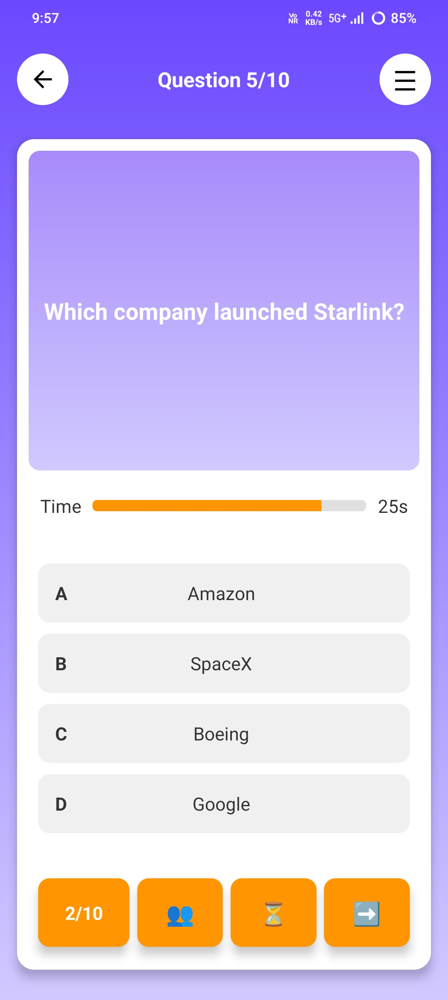
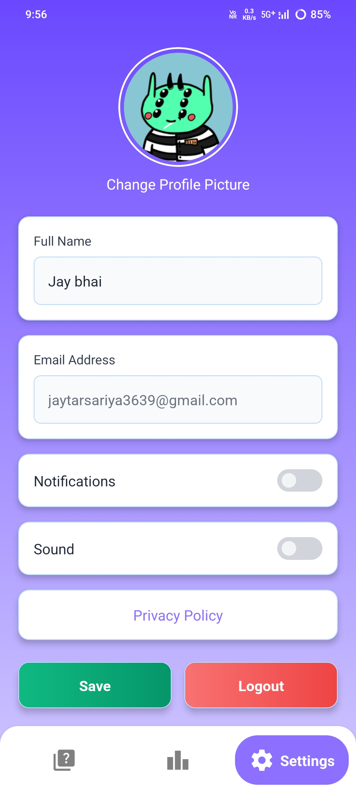
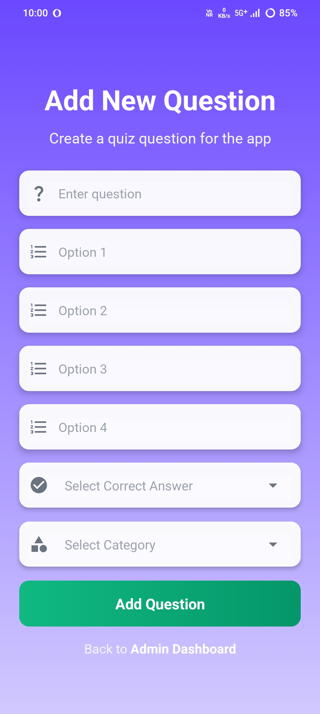

# QuizApp – Learning Quiz Platform

A React Native quiz application that allows users to participate in quizzes across different categories, track their scores, view leaderboards, manage their profiles, and customize application settings.

## 📱 Screenshots

### 🔐 Authentication

| Login                                            | Register                                            |
| ------------------------------------------------ | --------------------------------------------------- |
|  |  |

### 🏠 Home & Quiz

| Home / Categories                               | Quiz                                            |
| ----------------------------------------------- | ----------------------------------------------- |
|  |  |

### 🏆 Results & Leaderboard

| Result                                            | Leaderboard                                            |
| ------------------------------------------------- | ------------------------------------------------------ |
|  |  |

### 👤 Profile & Settings



### ⚙️ Admin Panel



---

## ✨ Features

### 👤 User Authentication

* Email and password registration
* Email and password login
* Email verification
* Google Sign-In
* User authentication using Firebase

### 📝 Quiz System

* Dynamic quiz categories
* Category-based quizzes
* Timed quizzes
* Randomized questions
* Randomized answer options
* Automatic score calculation
* Quiz result screen

### 🏆 Leaderboard

* Score-based leaderboard
* User ranking
* Firebase-powered leaderboard data

### 👤 Profile & Settings

* User profile
* Profile information
* Notification sound settings
* Application preferences

### ⚙️ Admin Panel

* Admin authentication flow
* Quiz/category management
* Administrative controls for quiz content

### 💳 Premium Features

* Stripe payment integration structure
* Premium purchase flow
* Secure backend integration planned for production payments

---

## 🛠️ Tech Stack

| Technology                 | Usage                           |
| -------------------------- | ------------------------------- |
| React Native               | Mobile application development  |
| JavaScript                 | Application logic               |
| Firebase Authentication    | User authentication             |
| Firebase Firestore         | Application data                |
| Firebase Realtime Database | Real-time data                  |
| Google Sign-In             | Social authentication           |
| AsyncStorage               | Local data storage              |
| React Navigation           | Application navigation          |
| Stripe                     | Payment integration             |
| Lottie                     | Animations                      |
| React Native Sound         | Notification/application sounds |

---

## 🔄 Application Flow

```text
User
 │
 ├── Register / Login
 │
 ├── Home
 │    └── Select Quiz Category
 │
 ├── Quiz
 │    ├── Answer Questions
 │    ├── Timer
 │    └── Submit Quiz
 │
 ├── Result
 │    └── Score
 │
 ├── Leaderboard
 │    └── View Rankings
 │
 └── Profile / Settings
      ├── Profile Information
      └── Sound Settings
```

---

## 📂 Project Structure

```text
QuizApp/
│
├── android/
├── ios/
│
├── src/
│   ├── AdminPannel/
│   ├── Auth/
│   ├── UserPannel/
│   └── assets/
│
├── App.jsx
├── package.json
├── .env.example
├── .gitignore
└── README.md
```

---

## 🔥 Firebase Configuration

This project uses Firebase for authentication and application data.

The application uses:

* Firebase Authentication
* Cloud Firestore
* Firebase Realtime Database
* Google Sign-In

### Local Firebase Setup

Firebase configuration files are intentionally excluded from the public repository.

For Android, configure your own:

```text
android/app/google-services.json
```

For iOS, configure your own:

```text
ios/GoogleService-Info.plist
```

Do not commit real Firebase configuration files containing project-specific credentials or configuration to a public repository unless you have intentionally reviewed and approved the exposure.

---

## 🔐 Environment Configuration

Sensitive or environment-specific values should be configured locally.

Create a local `.env` file based on:

```text
.env.example
```

Example:

```env
STRIPE_PUBLISHABLE_KEY=your_stripe_publishable_key
BACKEND_URL=your_backend_url
ADMIN_EMAIL=your_admin_email
ADMIN_PASSWORD=your_admin_password
```

> Never commit your real `.env` file to GitHub.

---

## 💳 Stripe Configuration

The project contains the structure for Stripe-based premium purchases.

For security reasons, sensitive Stripe operations should be handled through a secure backend rather than directly from the mobile application.

The public repository does **not** contain Stripe secret keys.

Before using Stripe payments in production:

1. Configure a secure backend.
2. Store Stripe secret keys only on the backend.
3. Create payment intents securely from the backend.
4. Return only the required information to the mobile application.
5. Configure the required environment variables locally.

---

## 🚀 Getting Started

### Prerequisites

Make sure you have installed:

* Node.js
* React Native development environment
* Android Studio
* Android SDK
* Java Development Kit
* Firebase project

For React Native CLI development, follow the official React Native environment setup for your operating system.

### 1. Clone the repository

```bash
git clone https://github.com/jaytarsariya-dev/react-native-quiz-app.git
```

### 2. Navigate to the project

```bash
cd react-native-quiz-app
```

### 3. Install dependencies

```bash
npm install
```

### 4. Configure environment variables

Create your local `.env` file using:

```text
.env.example
```

and add your own configuration values.

### 5. Configure Firebase

Add your own Firebase configuration files locally:

```text
android/app/google-services.json
```

and, when building for iOS:

```text
ios/GoogleService-Info.plist
```

### 6. Run the application

Start Metro:

```bash
npx react-native start
```

In another terminal, run Android:

```bash
npx react-native run-android
```

---

## 🔒 Security Notes

This repository has been prepared for public GitHub hosting.

The following sensitive items are excluded from the repository:

* `.env`
* Firebase configuration files
* Stripe secret keys
* Local debug keystore
* Other environment-specific configuration

The repository uses `.env.example` to demonstrate the required configuration without exposing real values.

For production use, authentication roles, Firebase security rules, and payment operations should be configured securely on the backend.

---

## 📌 Future Improvements

* Improve admin role management using Firebase custom claims
* Move complete Stripe payment processing to a secure backend
* Add more quiz categories
* Add additional quiz difficulty levels
* Improve analytics and user statistics
* Add push notifications
* Improve offline support
* Add more profile customization options
* Improve overall UI/UX

---

## 👨‍💻 Developer

**Jay Tarsariya**

React Native Developer | Mobile Application Developer

### Skills

* React Native
* JavaScript
* TypeScript
* Redux
* REST APIs
* Firebase
* SQLite
* React Navigation
* Git
* Android Development

---

## 📄 License

This project is intended for portfolio and educational purposes.
